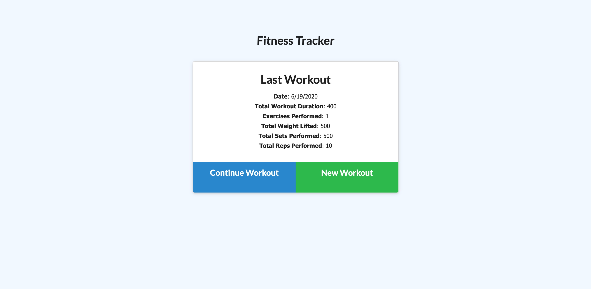
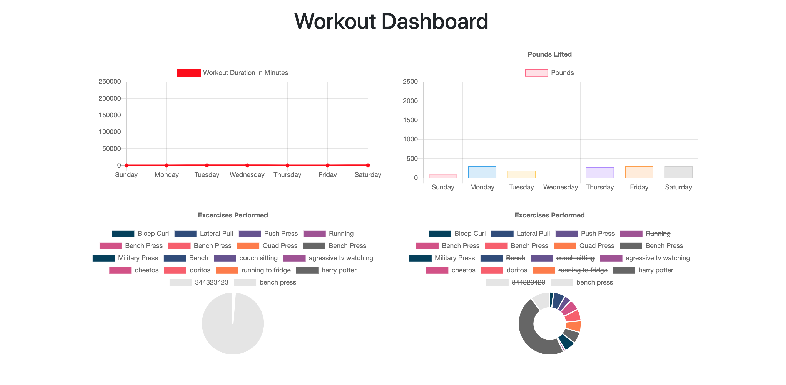

# Workout Tracker

### **Please [click here](https://frozen-wave-39380.herokuapp.com/) to visit the app page.**

It's easier to reach your fitness goals quicker when you track workout progress. Workout tracker lets users input and view statistics of their recent workouts. Built with a mongoose database to store information and express for routing. 

## User Story

` As a user, I want to be able to view create and track daily workouts. I want to be able to log multiple exercises in a workout on a given day. I should also be able to track the name, type, weight, sets, reps, and duration of exercise. If the exercise is a cardio exercise, I should be able to track my distance traveled.`

## Using the app

When the user loads the page, they should be given the option to create a new workout, or continue with their last workout.

The user is able to:
  * Track the type of workout, resistance or cardio

  * Add exercises to a previous workout plan.

  * Add new exercises to a new workout plan.

View workout statistics to visualize progress

